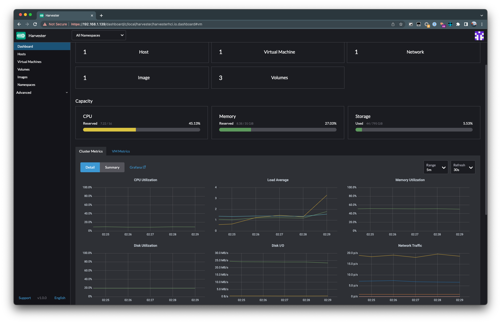
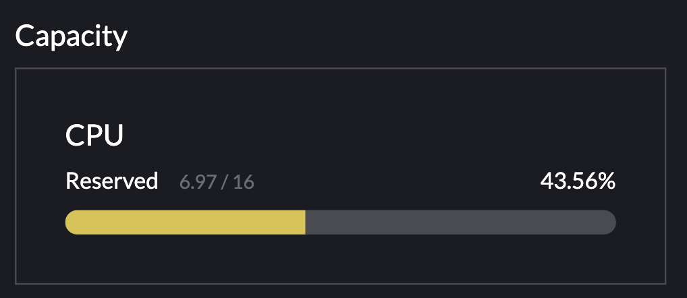

# Harvesterで始める自宅プライベートクラウド
Tsuzu([@\_tsuzu\_](https://twitter.com/_tsuzu_))

---
# Who am I?
- Handle: Tsuzu
- GitHub: [tsuzu](https://github.com/tsuzu)
- Twitter: [@\_tsuzu\_](https://twitter.com/_tsuzu_)
- Name: TSUHIYA Tsuzuki
- Like: Go/Kubernetes/cluster-api
- Hobby: RFA, Automation Games(ex. factorio)

---
# Agenda
- Harvesterとは?
- Harvesterを支える技術
- Harvester Pros/Cons
- まとめ

---
# Harvesterとは?
- https://harvesterhci.io
- https://github.com/harvester/harvester
- Rancher Labsが開発する **Hyper-converged Infrastructure** を実現するソフトウェア
    - Rancher LabsはSUSEに2020年に買収された

---
# Hyper-converged infrastructure
> Hyperconverged infrastructure (HCI) is a software-defined IT infrastructure that virtualizes all of the elements of conventional "hardware-defined" systems. HCI includes, at a minimum, virtualized computing (a hypervisor), software-defined storage, and virtualized networking.
> ... are implemented virtually in software (at or via the hypervisor) rather than physically in hardware.

- VM、ストレージ、ネットワーク等がソフトウェアによって仮想的に実現されている
- 別途共有ストレージなどが必要なく物理サーバ1台のみで実現可能
- [Wikipedia(en)](https://en.wikipedia.org/wiki/Hyper-converged_infrastructure) より引用

---
# Harvesterとは?
- https://harvesterhci.io
- https://github.com/harvester/harvester
- Rancher Labsが開発する **Hyper-converged Infrastructure** を実現するソフトウェア
    - Rancher LabsはSUSEに2020年に買収された
- OpenStackやVMware vSphereに(比較的)近い存在
- VM管理機能、分散ブロックストレージを持つ
- 最新 v1.0.1(2022/04/27 現在)

---
# Harvesterの仕組み
https://docs.harvesterhci.io/v1.0/assets/architecture.svg

---
# KubeVirtとは?
- https://kubevirt.io/
- Kubernetes上のカスタムリソースとしてVMを管理できるコントローラ
- 実装はQEMUのラッパー
- CNCF incubating project(2022/04/19~)
    - https://www.cncf.io/blog/2022/04/19/kubevirt-becomes-a-cncf-incubating-project/
- 最新 v0.52.0 (2022/04/27現在)

---
# KubeVirt Pros
- Kubernetesの資産が使える
    - コントローラによるReconciliation Loop
    - CNI
    - CSI
- コンテナ化していない/出来ないアプリケーションをKubernetes上で管理できる

---
# Longhorn
- Rancher Labsが開発する分散ブロックストレージ
- CSI driverとして実装
- https://longhorn.io/
- https://github.com/longhorn/longhorn
- CNCF incubating project
- 最新 v1.2.4 (2022/04/27現在)

---
# Harvesterの仕組み
- KubeVirt + Longhorn + ...
- multus: 複数のNIC及びCNIプラグインを併用するためのCNIプラグイン
- Prometheus/Grafana: 監視
- Web UI
- ([Terraform Provider](https://docs.harvesterhci.io/v1.0/terraform/terraform/))

---

---
# Harvester Pros
- 慣れ親しんだKubernetes(要出典)
- インストールが楽(ISO/PXEブート等で入れるだけで全て入る)
- 簡単に複数ノードのHAクラスタを構築
- Kubernetesクラスタも簡単に構築
    - Rancher Kubernetes Engine
    - cluster-api-provider-kubevirt(未検証)
- Web UIが便利

---
# Harvester Cons
- **リソース要求が大きすぎる(自宅的に)**
- 機能のopt-outが出来ない

---
### Spec requirements
|Type|Requirements|
|--|--|
|CPU |	x86_64 only. Hardware-assisted virtualization is required. 8-core processor minimum; 16-core or above preferred |
|Memory |	32 GB minimum, 64 GB or above preferred |
|Disk Capacity |	140 GB minimum, 500 GB or above preferred |
|Disk Performance |	5,000+ random IOPS per disk(SSD/NVMe). Management nodes (first 3 nodes) must be fast enough for Etcd. |
|Network Card |	1 Gbps Ethernet minimum, 10Gbps Ethernet recommended |

---
セットアップ直後でも

---
# Harvester Cons
- リソース要求が大きすぎる(自宅的に)
- **機能のopt-outが出来ない**
    - PrometheusやGrafanaも自動的にインストールされる
    - 最悪インストール後にkubectl delete

---
# まとめ
- KubeVirtでVMを起動できる環境が簡単に建てられる
- 分散ブロックストレージも監視もついてくる
- 必要リソースが大きめ(Intel NUCとかだと厳しい)

---
# Appendix
---

↑めちゃおもろい SUSE: /ˈsʊːsʌ/            https://www.youtube.com/watch?v=nLdexZlVkAY
